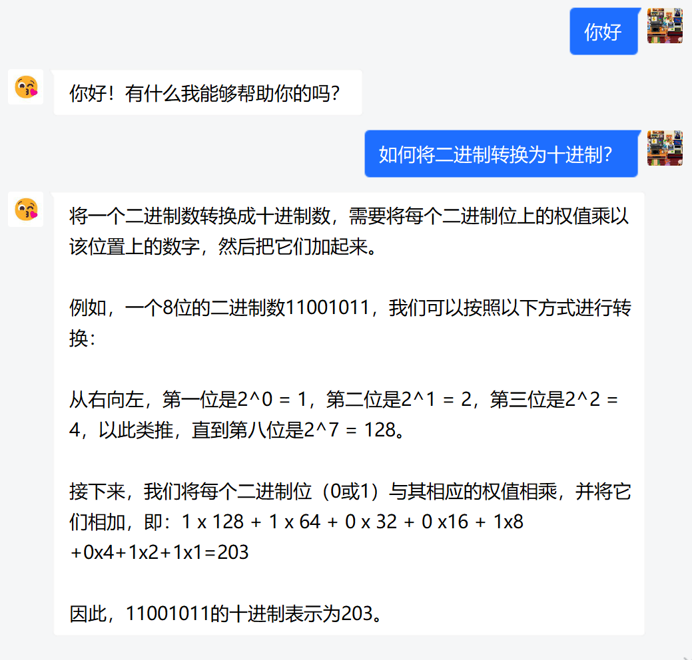
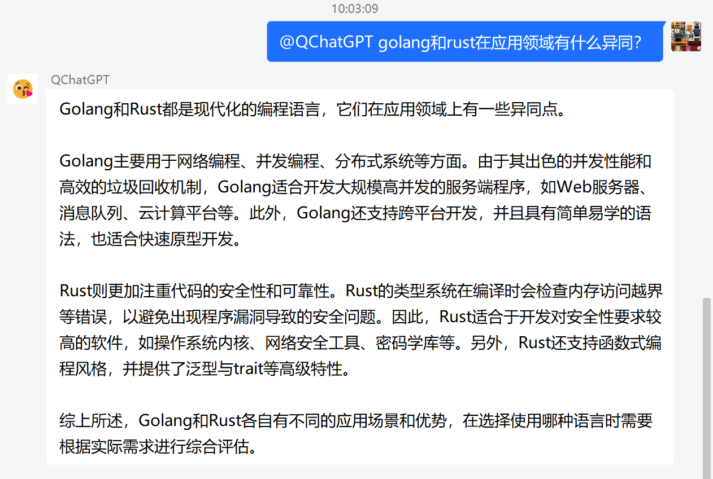
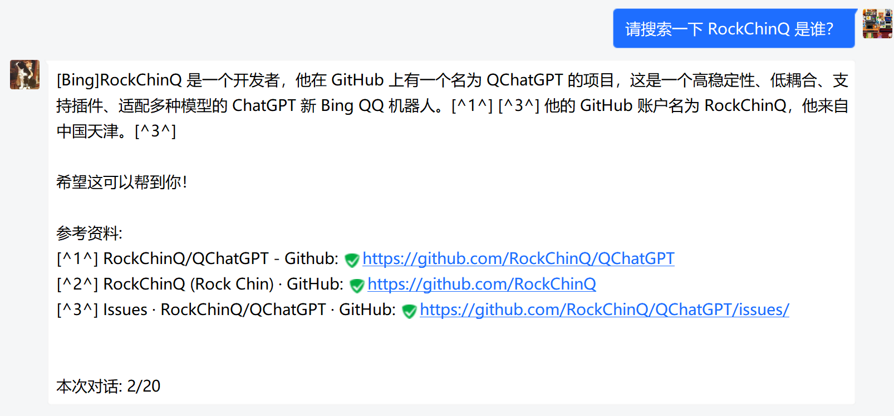
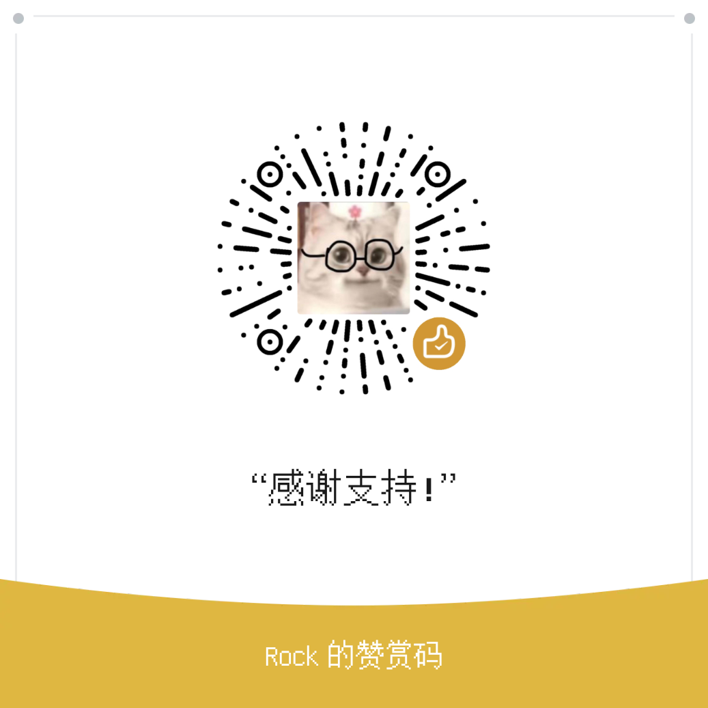

<p align="center">

</p>

<div align="center">

# QChatGPT

<!-- 高稳定性/持续迭代/架构清晰/支持插件/高可自定义的 ChatGPT QQ机器人框架 -->
<!-- “当然！下面是一个使用Java编写的快速排序算法的示例代码” -->

[](https://github.com/RockChinQ/QChatGPT/releases/latest)
<a href="https://hub.docker.com/repository/docker/rockchin/qchatgpt">
    
  </a>


<a href="https://github.com/RockChinQ/QChatGPT/wiki">

</a><br/>
<a href="http://qm.qq.com/cgi-bin/qm/qr?_wv=1027&k=66-aWvn8cbP4c1ut_1YYkvvGVeEtyTH8&authKey=pTaKBK5C%2B8dFzQ4XlENf6MHTCLaHnlKcCRx7c14EeVVlpX2nRSaS8lJm8YeM4mCU&noverify=0&group_code=195992197">

</a>
<a href="http://qm.qq.com/cgi-bin/qm/qr?_wv=1027&k=nC80H57wmKPwRDLFeQrDDjVl81XuC21P&authKey=2wTUTfoQ5v%2BD4C5zfpuR%2BSPMDqdXgDXA%2FS2wHI1NxTfWIG%2B%2FqK08dgyjMMOzhXa9&noverify=0&group_code=738382634">

</a>
<a href="https://qchatgpt.rockchin.top">

</a>
<a href="https://www.bilibili.com/video/BV14h4y1w7TC">

</a>
<a href="https://www.bilibili.com/video/BV11h4y1y74H">

</a>


<details>
<summary>回复效果演示（带有联网插件）</summary>

</details>
</div>

> **NOTE**  
> 2023/9/13 现已支持通过[One API](https://github.com/songquanpeng/one-api)接入 Azure、Anthropic Claude、Google PaLM 2、智谱 ChatGLM、百度文心一言、讯飞星火认知、阿里通义千问以及 360 智脑等模型，欢迎测试并反馈。  
> 2023/8/29 [逆向库插件](https://github.com/RockChinQ/revLibs)已支持 gpt4free  
> 2023/8/14 [逆向库插件](https://github.com/RockChinQ/revLibs)已支持Claude和Bard  
> 2023/7/29 支持使用GPT的Function Calling功能实现类似ChatGPT Plugin的效果，请见[Wiki内容函数](https://github.com/RockChinQ/QChatGPT/wiki/6-%E6%8F%92%E4%BB%B6%E4%BD%BF%E7%94%A8-%E5%86%85%E5%AE%B9%E5%87%BD%E6%95%B0)  

<details>
<summary>

## 🍺模型一览和功能点

</summary>

### 文字对话

- OpenAI GPT-3.5模型(ChatGPT API), 本项目原生支持, 默认使用
- OpenAI GPT-3模型, 本项目原生支持, 部署完成后前往`config.py`切换
- OpenAI GPT-4模型, 本项目原生支持, 目前需要您的账户通过OpenAI的内测申请, 请前往`config.py`切换
- ChatGPT网页版GPT-3.5模型, 由[插件](https://github.com/RockChinQ/revLibs)接入
- ChatGPT网页版GPT-4模型, 目前需要ChatGPT Plus订阅, 由[插件](https://github.com/RockChinQ/revLibs)接入
- New Bing逆向库, 由[插件](https://github.com/RockChinQ/revLibs)接入
- HuggingChat, 由[插件](https://github.com/RockChinQ/revLibs)接入, 仅支持英文
- Claude, 由[插件](https://github.com/RockChinQ/revLibs)接入
- Google Bard, 由[插件](https://github.com/RockChinQ/revLibs)接入

### 模型聚合平台

- [One API](https://github.com/songquanpeng/one-api), Azure、Anthropic Claude、Google PaLM 2、智谱 ChatGLM、百度文心一言、讯飞星火认知、阿里通义千问以及 360 智脑等模型的官方接口转换成 OpenAI API 接入，QChatGPT 原生支持，您需要先配置 One API，之后在`config.py`中设置反向代理和`One API`的密钥后使用。
- [gpt4free](https://github.com/xtekky/gpt4free), 破解以免费使用多个平台的各种文字模型, 由[插件](https://github.com/RockChinQ/revLibs)接入, 无需鉴权, 稳定性较差。
- [Poe](https://poe.com), 破解免费使用Poe上多个平台的模型, 由[oliverkirk-sudo/ChatPoeBot](https://github.com/oliverkirk-sudo/ChatPoeBot)接入（由于 Poe 上可用的大部分模型现已通过[revLibs插件](https://github.com/RockChinQ/revLubs)或其他方式接入，此插件现已停止维护）。

### 故事续写

- NovelAI API, 由[插件](https://github.com/dominoar/QCPNovelAi)接入

### 图片绘制

- OpenAI DALL·E模型, 本项目原生支持, 使用方法查看[Wiki功能使用页](https://github.com/RockChinQ/QChatGPT/wiki/1-%E5%8A%9F%E8%83%BD%E4%BD%BF%E7%94%A8#%E5%8A%9F%E8%83%BD%E7%82%B9%E5%88%97%E4%B8%BE)
- NovelAI API, 由[插件](https://github.com/dominoar/QCPNovelAi)接入

### 语音生成

- TTS+VITS, 由[插件](https://github.com/dominoar/QChatPlugins)接入
- Plachta/VITS-Umamusume-voice-synthesizer, 由[插件](https://github.com/oliverkirk-sudo/chat_voice)接入


安装[此插件](https://github.com/RockChinQ/Switcher)，即可在使用中切换文字模型。

### 功能点

<details>
<summary>✅支持敏感词过滤，避免账号风险</summary>

  - 难以监测机器人与用户对话时的内容，故引入此功能以减少机器人风险
  - 加入了百度云内容审核，在`config.py`中修改`baidu_check`的值，并填写`baidu_api_key`和`baidu_secret_key`以开启此功能
  - 编辑`sensitive.json`，并在`config.py`中修改`sensitive_word_filter`的值以开启此功能
</details>

<details>
<summary>✅群内多种响应规则，不必at</summary>

  - 默认回复`ai`作为前缀或`@`机器人的消息
  - 详细见`config.py`中的`response_rules`字段
</details>

<details>
<summary>✅完善的多api-key管理，超额自动切换</summary>

  - 支持配置多个`api-key`，内部统计使用量并在超额时自动切换
  - 请在`config.py`中修改`openai_config`的值以设置`api-key`
  - 可以在`config.py`中修改`api_key_fee_threshold`来自定义切换阈值
  - 运行期间向机器人说`!usage`以查看当前使用情况
</details>

<details>
<summary>✅支持预设文字</summary>

  - 支持以自然语言预设文字，自定义机器人人格等信息
  - 详见`config.py`中的`default_prompt`部分
  - 支持设置多个预设情景，并通过!reset、!default等命令控制，详细请查看[wiki命令](https://github.com/RockChinQ/QChatGPT/wiki/1-%E5%8A%9F%E8%83%BD%E4%BD%BF%E7%94%A8#%E6%9C%BA%E5%99%A8%E4%BA%BA%E6%8C%87%E4%BB%A4)
</details>

<details>
<summary>✅支持对话、绘图等模型，可玩性更高</summary>

  - 现已支持OpenAI的对话`Completion API`和绘图`Image API`
  - 向机器人发送命令`!draw <prompt>`即可使用绘图模型
</details>
<details>
<summary>✅支持命令控制热重载、热更新</summary>

  - 允许在运行期间修改`config.py`或其他代码后，以管理员账号向机器人发送命令`!reload`进行热重载，无需重启
  - 运行期间允许以管理员账号向机器人发送命令`!update`进行热更新，拉取远程最新代码并执行热重载
</details>
<details>
<summary>✅支持插件加载🧩</summary>

  - 自行实现插件加载器及相关支持
  - 支持GPT的Function Calling功能
  - 详细查看[插件使用页](https://github.com/RockChinQ/QChatGPT/wiki/5-%E6%8F%92%E4%BB%B6%E4%BD%BF%E7%94%A8)
</details>
<details>
<summary>✅私聊、群聊黑名单机制</summary>

  - 支持将人或群聊加入黑名单以忽略其消息
  - 详见Wiki`加入黑名单`节
</details>
<details>
<summary>✅长消息处理策略</summary>

  - 支持将长消息转换成图片或消息记录组件，避免消息刷屏
  - 请查看`config.py`中`blob_message_strategy`等字段
</details>
<details>
<summary>✅回复速度限制</summary>

  - 支持限制单会话内每分钟可进行的对话次数
  - 具有“等待”和“丢弃”两种策略
    - “等待”策略：在获取到回复后，等待直到此次响应时间达到对话响应时间均值
    - “丢弃”策略：此分钟内对话次数达到限制时，丢弃之后的对话
  - 详细请查看config.py中的相关配置
</details>
<details>
<summary>✅支持使用网络代理</summary>

  - 目前已支持正向代理访问接口
  - 详细请查看config.py中的`openai_config`的说明
</details>
<details>
<summary>✅支持自定义提示内容</summary>

  - 允许用户自定义报错、帮助等提示信息
  - 请查看`tips.py`
</details>

### 🏞️截图


<br/>

<br/>


详情请查看[Wiki功能使用页](https://github.com/RockChinQ/QChatGPT/wiki/1-%E5%8A%9F%E8%83%BD%E4%BD%BF%E7%94%A8)

</details>

<details>

<summary>

## 🚀部署和使用

</summary>

> **NOTE**  
> - 部署过程中遇到任何问题，请先在[QChatGPT](https://github.com/RockChinQ/QChatGPT/issues)或[qcg-installer](https://github.com/RockChinQ/qcg-installer/issues)的issue里进行搜索  
> - QChatGPT需要Python版本>=3.9  
> - 官方群和社区群群号请见文档顶部

### - 注册OpenAI账号

<details>
<summary>点此查看步骤</summary>

> 若您要直接使用非OpenAI的模型（如New Bing），可跳过此步骤，直接进行之后的部署，完成后按照相关插件的文档进行配置即可

参考以下文章自行注册

> [国内注册ChatGPT的方法(100%可用)](https://www.pythonthree.com/register-openai-chatgpt/)  
> [手把手教你如何注册ChatGPT，超级详细](https://guxiaobei.com/51461)

注册成功后请前往[个人中心查看](https://beta.openai.com/account/api-keys)api_key  
完成注册后，使用以下自动化或手动部署步骤

</details>

### - Docker或自动化部署

<details>
<summary>展开查看，以下方式二选一，Linux首选Docker，Windows首选安装器</summary>

#### Docker方式

> docker方式较为复杂，若您不**熟悉**docker的操作及相关知识，强烈建议您使用其他方式部署，我们**不会且难以**解决您主机上多个容器的连接问题。

请查看[此文档](res/docs/docker_deployment.md)  

#### 安装器方式

使用[此安装器](https://github.com/RockChinQ/qcg-installer)（若无法访问请到[Gitee](https://gitee.com/RockChin/qcg-installer)）进行部署

- 安装器目前仅支持部分平台，请到仓库文档查看，其他平台请手动部署

</details>

### - 手动部署
<details>
<summary>手动部署适用于所有平台</summary>

- 请使用Python 3.9.x以上版本   

#### ① 配置QQ登录框架

目前支持mirai和go-cqhttp，配置任意一个即可

<details>
<summary>mirai</summary>

1. 按照[此教程](https://yiri-mirai.wybxc.cc/tutorials/01/configuration)配置Mirai及mirai-api-http  
2. 启动mirai-console后，使用`login`命令登录QQ账号，保持mirai-console运行状态  
3. 在下一步配置主程序时请在config.py中将`msg_source_adapter`设为`yirimirai`

</details>

<details>
<summary>go-cqhttp</summary>

1. 按照[此文档](https://github.com/RockChinQ/QChatGPT/wiki/9-go-cqhttp%E9%85%8D%E7%BD%AE)配置go-cqhttp
2. 启动go-cqhttp，确保登录成功，保持运行
3. 在下一步配置主程序时请在config.py中将`msg_source_adapter`设为`nakuru`

</details>

#### ② 配置主程序

1. 克隆此项目

```bash
git clone https://github.com/RockChinQ/QChatGPT
cd QChatGPT
```

2. 安装依赖

```bash
pip3 install requests yiri-mirai openai colorlog func_timeout dulwich Pillow nakuru-project-idk CallingGPT tiktoken
```

3. 运行一次主程序，生成配置文件

```bash
python3 main.py
```

4. 编辑配置文件`config.py`

按照文件内注释填写配置信息

5. 运行主程序

```bash
python3 main.py
```

无报错信息即为运行成功

**常见问题**

- mirai登录提示`QQ版本过低`，见[此issue](https://github.com/RockChinQ/QChatGPT/issues/137)
- 如提示安装`uvicorn`或`hypercorn`请*不要*安装，这两个不是必需的，目前存在未知原因bug
- 如报错`TypeError: As of 3.10, the *loop* parameter was removed from Lock() since it is no longer necessary`, 请参考 [此处](https://github.com/RockChinQ/QChatGPT/issues/5)

</details>

**部署完成后必看: [命令说明](https://github.com/RockChinQ/QChatGPT/wiki/1-%E5%8A%9F%E8%83%BD%E4%BD%BF%E7%94%A8#%E6%9C%BA%E5%99%A8%E4%BA%BA%E6%8C%87%E4%BB%A4)**  

所有功能查看[Wiki功能使用页](https://github.com/RockChinQ/QChatGPT/wiki/1-%E5%8A%9F%E8%83%BD%E4%BD%BF%E7%94%A8)  

</details>

<details>
<summary>

## 🧩插件生态

</summary>

⭐我们已经支持了[GPT的Function Calling能力](https://platform.openai.com/docs/guides/gpt/function-calling)，请查看[Wiki内容函数](https://github.com/RockChinQ/QChatGPT/wiki/6-%E6%8F%92%E4%BB%B6%E4%BD%BF%E7%94%A8-%E5%86%85%E5%AE%B9%E5%87%BD%E6%95%B0)  

> 使用方法见：[Wiki插件使用](https://github.com/RockChinQ/QChatGPT/wiki/5-%E6%8F%92%E4%BB%B6%E4%BD%BF%E7%94%A8)  
> 开发教程见：[Wiki插件开发](https://github.com/RockChinQ/QChatGPT/wiki/7-%E6%8F%92%E4%BB%B6%E5%BC%80%E5%8F%91)


[所有插件列表](https://github.com/stars/RockChinQ/lists/qchatgpt-%E6%8F%92%E4%BB%B6)，欢迎提出issue以提交新的插件

### 部分插件

- [WebwlkrPlugin](https://github.com/RockChinQ/WebwlkrPlugin) - 让机器人能联网！！
- [revLibs](https://github.com/RockChinQ/revLibs) - 将ChatGPT网页版、Claude、Bard、Hugging Chat等破解版接入此项目，关于[官方接口和网页版有什么区别](https://github.com/RockChinQ/QChatGPT/wiki/8-%E5%AE%98%E6%96%B9%E6%8E%A5%E5%8F%A3%E3%80%81ChatGPT%E7%BD%91%E9%A1%B5%E7%89%88%E3%80%81ChatGPT-API%E5%8C%BA%E5%88%AB)
- [Switcher](https://github.com/RockChinQ/Switcher) - 支持通过命令切换使用的模型
- [hello_plugin](https://github.com/RockChinQ/hello_plugin) - `hello_plugin` 的储存库形式，插件开发模板
- [oliverkirk-sudo/chat_voice](https://github.com/oliverkirk-sudo/chat_voice) - 文字转语音输出，支持HuggingFace上的[VITS模型](https://huggingface.co/spaces/Plachta/VITS-Umamusume-voice-synthesizer),azure语音合成,vits本地语音合成,sovits语音合成
- [RockChinQ/WaitYiYan](https://github.com/RockChinQ/WaitYiYan) - 实时获取百度`文心一言`等待列表人数
- [chordfish-k/QChartGPT_Emoticon_Plugin](https://github.com/chordfish-k/QChartGPT_Emoticon_Plugin) - 使机器人根据回复内容发送表情包
- [oliverkirk-sudo/ChatPoeBot](https://github.com/oliverkirk-sudo/ChatPoeBot) - 接入[Poe](https://poe.com/)上的机器人
- [lieyanqzu/WeatherPlugin](https://github.com/lieyanqzu/WeatherPlugin) - 天气查询插件
- [SysStatPlugin](https://github.com/RockChinQ/SysStatPlugin) - 查看系统状态
- [oliverkirk-sudo/qchat_system_status](https://github.com/oliverkirk-sudo/qchat_system_status) - 以图片的形式输出系统状态
- [oliverkirk-sudo/QChatAIPaint](https://github.com/oliverkirk-sudo/QChatAIPaint) - 基于[Holara](https://holara.ai/)的ai绘图插件
- [oliverkirk-sudo/QChatCodeRunner](https://github.com/oliverkirk-sudo/QChatCodeRunner) - 基于[CodeRunner-Plugin](https://github.com/oliverkirk-sudo/CodeRunner-Plugin)的代码运行与图表生成插件
- [oliverkirk-sudo/QChatWeather](https://github.com/oliverkirk-sudo/QChatWeather) - 生成好看的天气图片，基于和风天气
- [oliverkirk-sudo/QChatMarkdown](https://github.com/oliverkirk-sudo/QChatMarkdown) - 将机器人输出的markdown转换为图片，基于[playwright](https://playwright.dev/python/docs/intro)
- [ruuuux/WikipediaSearch](https://github.com/ruuuux/WikipediaSearch) - Wikipedia 搜索插件

</details>

<details>

<summary>

## 😘致谢和赞赏

</summary>

- [@the-lazy-me](https://github.com/the-lazy-me) 为本项目制作[视频教程](https://www.bilibili.com/video/BV1Y14y1Q7kQ)
- [@mikumifa](https://github.com/mikumifa) 本项目Docker部署仓库开发者
- [@dominoar](https://github.com/dominoar) 为本项目开发多种插件
- [@万神的星空](https://github.com/qq255204159)  整合包发行
- [@ljcduo](https://github.com/ljcduo)  GPT-4 API内测账号提供

以及所有[贡献者](https://github.com/RockChinQ/QChatGPT/graphs/contributors)和其他为本项目提供支持的朋友们。



</details>
