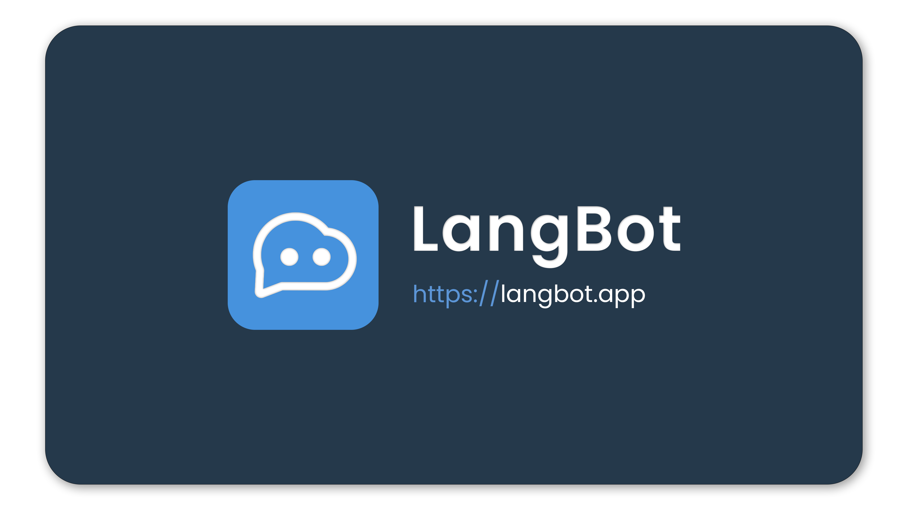

# QChatGPT🤖

<p align="center">

</p>

English | [简体中文](README.md)

[](https://github.com/RockChinQ/QChatGPT/releases/latest)


- Refer to [Wiki](https://github.com/RockChinQ/QChatGPT/wiki) to get further information.  
- Official QQ group: 656285629  
- Community QQ group: 362515018
- QQ channel robot: [QQChannelChatGPT](https://github.com/Soulter/QQChannelChatGPT)
- Any contribution is welcome, please refer to [CONTRIBUTING.md](CONTRIBUTING.md)

## 🍺List of supported models

<details>
<summary>Details</summary>

### Chat

- OpenAI GPT-3.5 (ChatGPT API), default model
- OpenAI GPT-3, supported natively, switch to it in `config.py`
- OpenAI GPT-4, supported natively, qualification for internal testing required, switch to it in `config.py`
- ChatGPT website edition (GPT-3.5), see [revLibs plugin](https://github.com/RockChinQ/revLibs)
- ChatGPT website edition (GPT-4), ChatGPT plus subscription required, see [revLibs plugin](https://github.com/RockChinQ/revLibs)
- New Bing, see [revLibs plugin](https://github.com/RockChinQ/revLibs)
- HuggingChat, see [revLibs plugin](https://github.com/RockChinQ/revLibs), English only

### Story

- NovelAI API, see [QCPNovelAi plugin](https://github.com/dominoar/QCPNovelAi)

### Image

- OpenAI DALL·E, supported natively, see [Wiki(cn)](https://github.com/RockChinQ/QChatGPT/wiki/%E5%8A%9F%E8%83%BD%E4%BD%BF%E7%94%A8#%E5%8A%9F%E8%83%BD%E7%82%B9%E5%88%97%E4%B8%BE)
- NovelAI API, see [QCPNovelAi plugin](https://github.com/dominoar/QCPNovelAi)

### Voice

- TTS+VITS, see [QChatPlugins](https://github.com/dominoar/QChatPlugins)
- Plachta/VITS-Umamusume-voice-synthesizer, see [chat_voice plugin](https://github.com/oliverkirk-sudo/chat_voice)


</details>

Install this [plugin](https://github.com/RockChinQ/Switcher) to switch between different models.

## ✅Function Points

<details>
<summary>Details</summary>

 - ✅Sensitive word filtering, avoid being banned
 - ✅Multiple responding rules, including regular expression matching
 - ✅Multiple api-key management, automatic switching when exceeding
 - ✅Support for customizing the preset prompt text
 - ✅Chat, story, image, voice, etc. models are supported
 - ✅Support for hot reloading and hot updating
 - ✅Support for plugin loading
 - ✅Blacklist mechanism for private chat and group chat
 - ✅Excellent long message processing strategy
 - ✅Reply rate limitation
 - ✅Support for network proxy
 - ✅Support for customizing the output format
</details>

More details, see [Wiki(cn)](https://github.com/RockChinQ/QChatGPT/wiki/%E5%8A%9F%E8%83%BD%E4%BD%BF%E7%94%A8#%E5%8A%9F%E8%83%BD%E7%82%B9%E5%88%97%E4%B8%BE)

## 🔩Deployment

**If you encounter any problems during deployment, please search in the issue of [QChatGPT](https://github.com/RockChinQ/QChatGPT/issues) or [qcg-installer](https://github.com/RockChinQ/qcg-installer/issues) first.**

### - Register OpenAI account

> If you want to use a model other than OpenAI (such as New Bing), you can skip this step and directly refer to following steps, and then configure it according to the relevant plugin documentation.

To register OpenAI account, please refer to the following articles(in Chinese):

> [国内注册ChatGPT的方法(100%可用)](https://www.pythonthree.com/register-openai-chatgpt/)  
> [手把手教你如何注册ChatGPT，超级详细](https://guxiaobei.com/51461)

Check your api-key in [personal center](https://beta.openai.com/account/api-keys) after registration, and then follow the following steps to deploy.

### - Deploy Automatically

<details>
<summary>Details</summary>

#### Docker

See [this document(cn)](res/docs/docker_deploy.md)  
Contributed by [@mikumifa](https://github.com/mikumifa)

#### Installer

Use [this installer](https://github.com/RockChinQ/qcg-installer) to deploy.

- The installer currently only supports some platforms, please refer to the repository document for details, and manually deploy for other platforms

</details>

### - Deploy Manually
<details>
<summary>Manually deployment supports any platforms</summary>

- Python 3.9.x or higher

#### 配置QQ登录框架

Currently supports mirai and go-cqhttp, configure either one

<details>
<summary>mirai</summary>

Follow [this tutorial(cn)](https://yiri-mirai.wybxc.cc/tutorials/01/configuration) to configure Mirai and YiriMirai.  
After starting mirai-console, use the `login` command to log in to the QQ account, and keep the mirai-console running.

</details>

<details>
<summary>go-cqhttp</summary>

1. Follow [this tutorial(cn)](https://github.com/RockChinQ/QChatGPT/wiki/go-cqhttp%E9%85%8D%E7%BD%AE) to configure go-cqhttp.
2. Start go-cqhttp, make sure it is logged in and running.

</details>

#### Configure QChatGPT

1. Clone the repository

```bash
git clone https://github.com/RockChinQ/QChatGPT
cd QChatGPT
```

2. Install dependencies

```bash
pip3 install requests yiri-mirai openai colorlog func_timeout dulwich Pillow nakuru-project-idk
```

3. Generate `config.py`

```bash
python3 main.py
```

4. Edit `config.py`

5. Run

```bash
python3 main.py
```

Any problems, please refer to the issues page.

</details>

## 🚀Usage

**After deployment, please read: [Commands(cn)](https://github.com/RockChinQ/QChatGPT/wiki/%E5%8A%9F%E8%83%BD%E4%BD%BF%E7%94%A8#%E6%9C%BA%E5%99%A8%E4%BA%BA%E6%8C%87%E4%BB%A4)**  

**For more details, please refer to the [Wiki(cn)](https://github.com/RockChinQ/QChatGPT/wiki/%E5%8A%9F%E8%83%BD%E4%BD%BF%E7%94%A8#%E4%BD%BF%E7%94%A8%E6%96%B9%E5%BC%8F)**


## 🧩Plugin Ecosystem

Plugin [usage](https://github.com/RockChinQ/QChatGPT/wiki/%E6%8F%92%E4%BB%B6%E4%BD%BF%E7%94%A8) and [development](https://github.com/RockChinQ/QChatGPT/wiki/%E6%8F%92%E4%BB%B6%E5%BC%80%E5%8F%91) are supported.

<details>
<summary>List of plugins (cn)</summary>

### Examples

在`tests/plugin_examples`目录下，将其整个目录复制到`plugins`目录下即可使用

- `cmdcn` - 主程序指令中文形式
- `hello_plugin` - 在收到消息`hello`时回复相应消息
- `urlikethisijustsix` - 收到冒犯性消息时回复相应消息

### More Plugins

欢迎提交新的插件

- [revLibs](https://github.com/RockChinQ/revLibs) - 将ChatGPT网页版接入此项目，关于[官方接口和网页版有什么区别](https://github.com/RockChinQ/QChatGPT/wiki/%E5%AE%98%E6%96%B9%E6%8E%A5%E5%8F%A3%E4%B8%8EChatGPT%E7%BD%91%E9%A1%B5%E7%89%88)
- [Switcher](https://github.com/RockChinQ/Switcher) - 支持通过指令切换使用的模型
- [hello_plugin](https://github.com/RockChinQ/hello_plugin) - `hello_plugin` 的储存库形式，插件开发模板
- [dominoar/QChatPlugins](https://github.com/dominoar/QchatPlugins) - dominoar编写的诸多新功能插件（语音输出、Ranimg、屏蔽词规则等）
- [dominoar/QCP-NovelAi](https://github.com/dominoar/QCP-NovelAi) - NovelAI 故事叙述与绘画
- [oliverkirk-sudo/chat_voice](https://github.com/oliverkirk-sudo/chat_voice) - 文字转语音输出，使用HuggingFace上的[VITS-Umamusume-voice-synthesizer模型](https://huggingface.co/spaces/Plachta/VITS-Umamusume-voice-synthesizer)
- [RockChinQ/WaitYiYan](https://github.com/RockChinQ/WaitYiYan) - 实时获取百度`文心一言`等待列表人数
- [chordfish-k/QChartGPT_Emoticon_Plugin](https://github.com/chordfish-k/QChartGPT_Emoticon_Plugin) - 使机器人根据回复内容发送表情包
- [oliverkirk-sudo/ChatPoeBot](https://github.com/oliverkirk-sudo/ChatPoeBot) - 接入[Poe](https://poe.com/)上的机器人
- [lieyanqzu/WeatherPlugin](https://github.com/lieyanqzu/WeatherPlugin) - 天气查询插件
</details>

## 😘Thanks

- [@the-lazy-me](https://github.com/the-lazy-me) video tutorial creator
- [@mikumifa](https://github.com/mikumifa) Docker deployment
- [@dominoar](https://github.com/dominoar) Plugin development
- [@万神的星空](https://github.com/qq255204159) Packages publisher
- [@ljcduo](https://github.com/ljcduo)  GPT-4 API internal test account

And all [contributors](https://github.com/RockChinQ/QChatGPT/graphs/contributors) and other friends who support this project.

<!-- ## 👍赞赏

 -->
